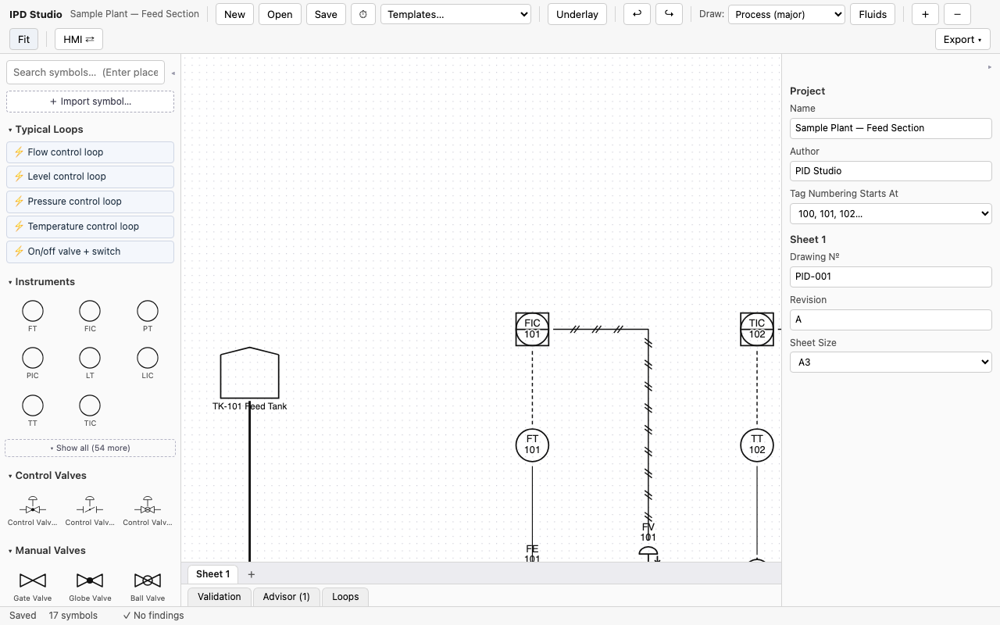
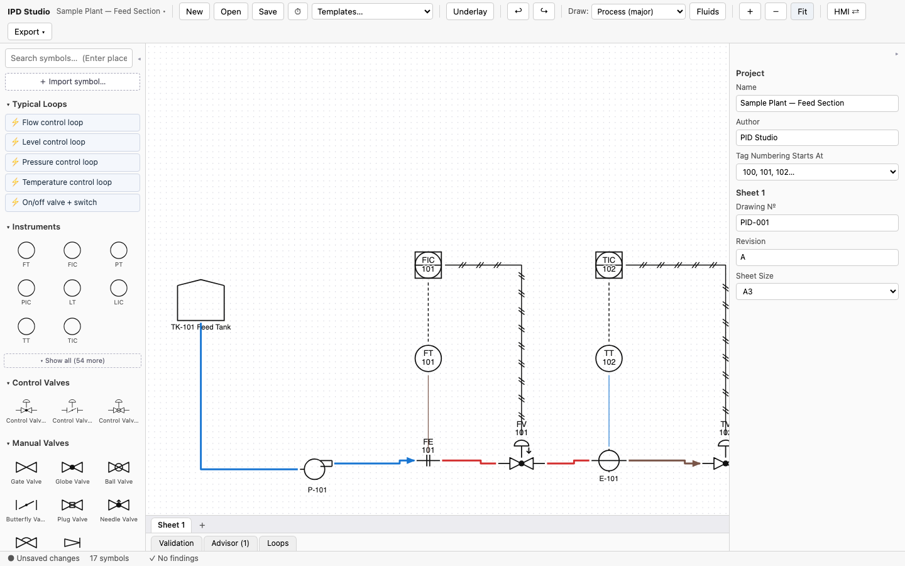
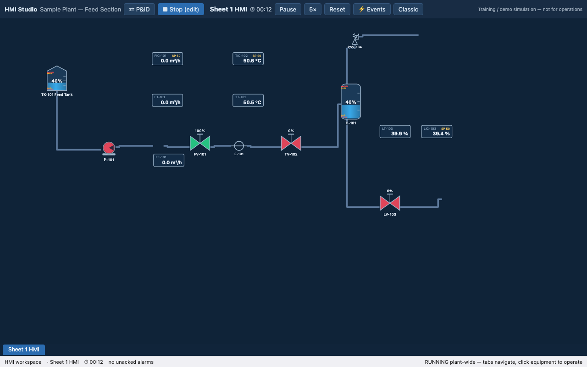

# IPD Studio

[](https://github.com/Coldbari/IPD-Studio/actions/workflows/ci.yml)
[](https://github.com/sponsors/Coldbari)
[](https://pid-studio-praharsh.web.app)
[](LICENSE)
[](COMMERCIAL-LICENSE.md)

**Source-available, browser-based intelligent P&ID editor.** Drag ISA-5.1-style
symbols onto a sheet, connect process and signal lines with proper orthogonal
routing, tag instruments with validated ISA tags — and generate real
engineering deliverables.

Sign in once and your drawings follow you: every P&ID, HMI screen and cost
estimate is saved to your account and opens on whatever machine you use next.

> **Licensing in one line:** free for personal, academic, nonprofit, and
> government use — **commercial use requires a paid license.**
> See [COMMERCIAL-LICENSE.md](COMMERCIAL-LICENSE.md).

**▶ Try it now: [pid-studio-praharsh.web.app](https://pid-studio-praharsh.web.app)** — pick *Templates → Sample plant* for a demo.
**🌐 Project site: [coldbari.github.io/IPD-Studio](https://coldbari.github.io/IPD-Studio/)**

<p align="center">
  
</p>
<p align="center"><em>A real drawing session, sped up: place instruments → draw the loops → color the services → open it in HMI Studio.<br>
<strong><a href="docs/media/demo-full.mp4">▶ Watch the full 2½-minute video</a></strong></em></p>

<p align="center">
  
</p>
<p align="center"><em>The editor: ISA-5.1 palette with instrument presets and typical loops, multi-sheet drawings, live validation & advisor.</em></p>

<p align="center">
  
  
</p>
<p align="center"><em>Left: fluid services color whole line runs (water/steam/slurry). Right: the same plant in HMI Studio — tanks, valves, pumps, and displays ready to simulate.</em></p>

## Why

Every browser diagramming tool treats a P&ID as clipart. Every intelligent
P&ID tool is a $2,600+/year desktop install. IPD Studio is the missing thing:
**data behind the drawing, in the browser, free for noncommercial use.**

- Tags are parsed and validated against ISA-5.1 letter tables — type `FIC` and
  the editor knows it's a *Flow Indicating Controller*
- Loop numbers auto-assign; duplicates are flagged live
- Control loops derive automatically from the tags
- The instrument index and line list are generated from the model, not typed
- The document is versioned open JSON, designed to map onto DEXPI

## Features

- **HMI Studio** — build operator screens from your P&ID (or import them in
  one click) and run them as a live training simulation: DCS-style faceplates,
  PI control loops auto-wired from your ISA tags, ISA-18.2 alarms (priorities,
  deadband, shelve/out-of-service), multi-pen trends with a real time axis,
  motor-driven equipment (pumps, compressors, conveyors) you can start, stop,
  and trip, flow-network simulation with fan-out, training upsets (trip a
  pump, stick a valve, plug a line), classic and ISA-101 high-performance
  themes ([docs](docs/HMI.md))
- **Budget & cost estimator** — set a project budget and watch the estimate
  grow live as you draw: every component carries a budgetary market price
  (editable per project or per component), grouped cost breakdown with
  installed-cost factors (Lang-style), over-budget warning in the status
  bar, and a cost estimate CSV export
- **Fluid services** — define media once (Water blue, Steam red, Slurry
  brown…), assign one to a line and the color spreads along the whole
  connected run; imported HMI pipes inherit it
- **Full instrumentation palette** — a 60-entry ISA-5.1 preset catalog
  (every element/transmitter/indicator/controller/converter/switch for
  flow, pressure, level, temperature, analysis + more), searchable by
  shortcut (`FT`) or full name ("flow transmitter"), placed pre-tagged with
  per-type auto-numbering
- **195+ parametric symbols** — instrument bubbles (all
  16 ISA display/location variants from one parameterized symbol), control
  valves with 7 actuator types and fail-action marks, 14 manual valve types,
  safety/relief devices, 14 flow elements, level/temperature/pressure
  accessories, pumps, compressors, turbines, spheres, silos, columns,
  reactors, separators, heat exchangers, fired heaters, cooling towers,
  ISA-5.2 logic gates (AND/OR/NOT), DCS/PLC/SIS system boxes, fittings,
  solids handling (conveyors, crushers, dryers, clarifiers), boilers, flares,
  MCC/UPS/IS barriers, steam trap variants, solenoid (XV) and motor-operated
  (MOV) valves, foot/ball-check/float valves, air filter regulators, pulsation
  dampeners, drain funnels, fans, coils — plus **your own imported SVG
  symbols** with a click-to-place port editor
- **16 line classes** with correct ISA rendering: heavy/light process,
  impulse, electric (dashed), pneumatic (double slash), hydraulic, capillary,
  data/software (circles), electromagnetic, jacketed (double line),
  heat-traced, underground, existing, battery limit
- **Multi-sheet projects** — sheet tabs, per-sheet title blocks, off-page
  connectors linked across sheets with jump-to-target, project-wide tag
  validation
- **DEXPI-oriented export *and import*** — Proteus Schema 4.2-shaped XML with
  a documented model mapping ([docs/DEXPI-MAPPING.md](docs/DEXPI-MAPPING.md));
  IPD Studio files round-trip, foreign files map via ComponentClass
- **CAD interop** — layered R12 **DXF export** (opens in AutoCAD/LibreCAD),
  and **DXF underlay import**: load a legacy drawing as a locked gray
  background and redraw intelligently on top
  ([DWG findings](docs/DWG-IMPORT-SPIKE.md))
- **Generated deliverables** — one-click **ISA-5.4-style loop diagrams**
  (field / marshalling / control room with numbered terminals) and
  **ISA-20-style instrument datasheets** (form editor, PDF, CSV matrix)
- **Works offline** — installable PWA; the whole editor runs with no internet
- **Editor power** — Ctrl+F find-any-tag across sheets, align/distribute,
  live snap guides, print-all-sheets PDF, line sequence auto-numbering
- **Magnetic docking** — drag a symbol so its connection point touches
  another symbol's and let go: it clicks into place already piped up. Pull
  them apart and the line stretches to follow
- **Obstacle-avoiding orthogonal routing** with draggable waypoints, ports
  with connection rules (a pneumatic signal won't connect to a pipe nozzle)
- **Live validation**: duplicate tags, missing tags, illegal ISA letters,
  dangling lines, incompatible connections, duplicate line numbers
- **Deliverables**: SVG + PNG export, print-to-PDF at true sheet scale
  (A4–A1, ANSI B/D) with title block, instrument index CSV, line list CSV,
  DEXPI XML — plus starter templates
- **Editor**: zoom-to-cursor, pan, marquee select, undo/redo, copy/paste,
  rotate, snap-to-grid, keyboard shortcuts, autosave with restore

## Quick start

```bash
git clone https://github.com/Coldbari/IPD-Studio.git
cd IPD-Studio
npm install
npm run dev     # open http://localhost:5173, Templates → Sample for a demo plant
npm test        # 600+ unit tests
npx playwright test   # e2e suite (starts its own dev server)
```

Building and running it yourself is free for noncommercial use. Running it for
or inside a business needs a [commercial license](COMMERCIAL-LICENSE.md).

## Running your own instance

IPD Studio runs **fully local out of the box**. Clone, `npm install`, `npm run
dev` — draw, validate, generate deliverables, and save `.pnid` files to your
computer. No backend, no account, no configuration.

Accounts and cloud drawings are the only things that need a server, and they are
switched off unless you point the app at a Firebase project of your own:

```bash
cp .env.example .env.local   # then fill in your own Firebase web config
```

`.env.example` walks through creating the project. This repo ships the
`firestore.rules` that protect the data, so `firebase deploy --only
firestore:rules` reproduces the same security model.

**A fork never talks to the upstream project.** There is no built-in Firebase
config to inherit — without `.env.local` the sign-in screen and cloud drawings
simply don't appear. That is deliberate: a hardcoded fallback would sign a
fork's users into someone else's database.

## File format

Drawings save as `.pnid.json` — versioned, human-readable JSON
(`schemaVersion`, sheet metadata, `nodes[]`, `edges[]`). See
[examples/sample-plant.pnid.json](examples/sample-plant.pnid.json).

## Roadmap

- Custom **HMI widgets from your own SVG** with animation bindings (level
  fills, spin-on-run) — the same import pipeline the P&ID symbols already have
- Legend sheet generation (line classes + fluid colors in use)
- Real-time collaboration (opt-in self-hosted sync; the no-backend
  local-first default stays), review comments
- DEXPI conformance hardening; in-app DWG per the
  [spike findings](docs/DWG-IMPORT-SPIKE.md)

## Contributing

PRs, symbol requests, and bug reports are all welcome — start with
[CONTRIBUTING.md](CONTRIBUTING.md) for the fork→branch→PR flow, the
architecture in one paragraph, and the how-to for adding a symbol. If you're
a practicing I&C or process engineer, even a "this convention is wrong"
issue is a valuable contribution.

Because the project sells commercial licenses to fund itself, code
contributions need a one-line
[CLA](CONTRIBUTING.md#contributor-license-agreement-cla). Issues, bug reports,
and symbol requests need nothing.

## ☕ Buy me a coffee

IPD Studio is free for students, hobbyists, researchers, and nonprofits — and
stays that way. But behind every calm-starting plant and every routed pipe
there's a developer running on coffee.

**[☕ Buy me a coffee → keep the pumps running](https://github.com/sponsors/Coldbari)**

One coffee a month keeps the symbols coming; a bigger one moves your feature
requests to the front of the queue.

*Using it at a company? That's a [commercial
license](COMMERCIAL-LICENSE.md), not a coffee — and it's what keeps the tool
free for everyone above.*

## Symbols & standards

Symbols are authored independently as original SVG from public-domain
geometric conventions. This project is not affiliated with or endorsed by the
International Society of Automation. "ISA" is referenced solely to describe
the drawing conventions the symbols follow.

## License & commercial use

**[PolyForm Noncommercial 1.0.0](LICENSE)** — source-available, not open
source. The code is public so you can read it, learn from it, and verify what
it does. Commercial use is not granted.

**Free, no permission needed:**

- Personal use, study, research, hobby projects
- Students and coursework
- Educational institutions, universities, labs
- Charities, public research bodies, public health and safety organizations,
  environmental organizations, and government institutions

**Requires a paid commercial license:**

- Use by or on behalf of a for-profit company, *including internal use*
- P&IDs drawn for paid client or consulting work
- Paid operator training delivered with HMI Studio
- Embedding, hosting, or reselling IPD Studio in any form

Your drawings are always yours — the license covers the software, not the
documents you produce with it.

Commercial licensing is friendly and priced to scale:
[COMMERCIAL-LICENSE.md](COMMERCIAL-LICENSE.md) or praharshchamp610@gmail.com.

**License history:** versions up to **v0.12.1** were released under
AGPL-3.0-only, and that grant is perpetual for anyone who received them.
**v0.13.0 and later** are PolyForm Noncommercial.

Copyright © 2026 Praharsh Nagpure. See [LICENSE](LICENSE) and [NOTICE](NOTICE).
